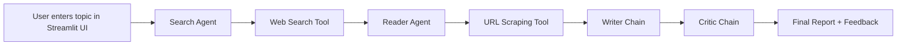

# Multi-agent-Research-System
An AI-powered research system that searches the web, reads the most relevant source to transform a user-provided topic into a structured, professional research report which can be downloaded.

The application accepts a research topic from the user and processes it
through four stages:

Search Agent: searches the web for recent and relevant information.

Reader Agent: selects a relevant URL from the search results and scrapes it for deeper content.

Writer Chain: combines the gathered research and produces a structured research report.

Critic Chain: reviews the generated report, assigns a score, identifies strengths and weaknesses, and provides a final verdict.

The Streamlit interface visualizes these stages as a pipeline and displays both intermediate research outputs and the final report.


# Architecture


                         +----------------------+
                         |        User          |
                         |  Research Topic      |
                         +----------+-----------+
                                    |
                                    v
                         +----------------------+
                         |     Streamlit UI     |
                         |       app.py         |
                         +----------+-----------+
                                    |
                                    v
                         +----------------------+
                         |  Research Pipeline   |
                         |    pipeline.py       |
                         +----------+-----------+
                                    |
                  +-----------------+-----------------+
                  |                                   |
                  v                                   v
        +-------------------+               +-------------------+
        |   Search Agent    |               |   Reader Agent    |
        |    agents.py      |               |    agents.py      |
        +---------+---------+               +---------+---------+
                  |                                   |
                  v                                   v
        +-------------------+               +-------------------+
        |   Tavily Search   |               |  URL Scraper      |
        |     tools.py      |               |     tools.py      |
        +-------------------+               +-------------------+
                  \                                   /
                   \                                 /
                    +---------------+---------------+
                                    |
                                    v
                         +----------------------+
                         |    Writer Chain      |
                         |      agents.py       |
                         +----------+-----------+
                                    |
                                    v
                         +----------------------+
                         |    Critic Chain      |
                         |      agents.py       |
                         +----------+-----------+
                                    |
                                    v
                         +----------------------+
                         | Final Report +       |
                         | Critic Feedback      |
                         +----------------------+


## Overview

ResearchMind simulates a small research team with four specialized components:

1. Search Agent — finds relevant and recent information online.
2. Reader Agent — opens a selected URL and extracts meaningful content.
3. Writer Chain — turns the gathered information into a professional research report.
4. Critic Chain — reviews the report and gives a score, strengths, weaknesses, and verdict.

The front-end is built using Streamlit, so users can interact with the system in a simple browser interface without needing to write code during use.

---

## Why this project is useful

This project demonstrates how multiple AI agents can collaborate to perform real research tasks. Instead of relying on a single model to do everything, the system splits responsibilities:

- one agent gathers information,
- another reads the most promising source,
- another writes a polished explanation,
- and another evaluates the final quality.

This is a practical example of agent-based workflows, tool calling, and LLM orchestration in Python.

---

## Project architecture



### System flow

- The user enters a research topic in the Streamlit app.
- The Search Agent uses Tavily to find recent web results.
- The Reader Agent selects the best URL and scrapes its content.
- The Writer Chain creates a detailed report with structure and citations-like source references.
- The Critic Chain evaluates the report and provides feedback.

---

## Tech stack

- Python 3.10+
- Streamlit — interactive front-end
- LangChain — agent orchestration and prompt chaining
- Tavily — web search API
- BeautifulSoup — HTML cleaning and scraping
- Requests — fetching web pages
- Python-dotenv — managing environment variables
- TokenRouter API — LLM access endpoint

---

## Project structure

```text
Multi-agent system/
├── app.py                 # Streamlit UI and workflow orchestration
├── agents.py              # LLM setup and agent/chain definitions
├── pipeline.py            # Terminal-based research pipeline
├── tools.py               # Search and scraping tools
├── requirements.txt       # Python dependencies
├── .env.example           # Example environment variables
├── .env                   # Your local secrets (not committed to GitHub)
├── envi/                  # Virtual environment (local only)
└── README.md              # Project documentation
```

---

## File-by-file explanation

### app.py

This is the main user interface for the project.

It contains:

- Streamlit page styling and dark theme
- input form for the topic
- pipeline status cards
- result display for search data, scraped content, final report, and critic review
- download button for exporting the generated report as a Markdown file

This file is the visual layer of the app, making the AI research pipeline accessible to non-developers.

### agents.py

This file sets up the AI model and defines the agents/chains used by the system.

It contains:

- model configuration using ChatOpenAI with a TokenRouter-compatible endpoint
- `build_search_agent()`
- `build_reader_agent()`
- `writer_prompt` and `writer_chain`
- `critic_prompt` and `critic_chain`

The separation of concerns is important: the search agent does not write the research report, and the reader agent does not review the final content.

### pipeline.py

This file is a script version of the system for terminal use.

It executes the same workflow programmatically:

- search for the topic
- scrape the most relevant page
- generate a report
- critique the report
- return a final dictionary containing the results

This file is useful for debugging and demonstration when you do not want to run the Streamlit app.

### tools.py

This file defines the actual external tools used by the agents.

#### `web_search(query: str) -> str`

- Uses Tavily to search for relevant web results
- Returns a list of titles, URLs, and snippets

#### `scrape_url(url: str) -> str`

- Downloads a page using `requests`
- Parses the HTML with BeautifulSoup
- Removes non-content blocks like scripts, styles, nav bars, and footers
- Returns cleaned text content for the model to read

This is the main data-gathering layer of the system.

---

## How the AI pipeline works

The application follows this structure:

### 1. Search phase

The system uses a search agent with a web-search tool.

The query is something like:

> Find recent, reliable and detailed information about: {topic}

The tool returns results that include:

- title
- URL
- snippet

This gives the model a shortlist of useful sources.

### 2. Reading phase

The reader agent receives the search results and chooses the most relevant URL.

It then calls the scraping tool to fetch the page and extract clean text. This allows the model to inspect the actual content of the source instead of relying only on short snippets.

### 3. Writing phase

The writer chain uses the search output and scraped output to generate a final research report.

The prompt instructs the model to organize the response into:

- Introduction
- Key Findings
- Conclusion
- Sources

This makes the output readable and professional.

### 4. Critique phase

The critic chain reviews the generated report and responds in a strict evaluation format:

- Score
- Strengths
- Areas to Improve
- One-line verdict

This helps the user understand the quality of the generated research and where it might improve.

---

## Installation and setup

### 1. Clone the repository

```bash
git clone https://github.com/your-username/your-repository-name.git
cd your-repository-name
```

### 2. Create a virtual environment

```bash
python -m venv .venv
```

On Windows:

```bash
.venv\Scripts\activate
```

On macOS/Linux:

```bash
source .venv/bin/activate
```

### 3. Install dependencies

```bash
pip install -r requirements.txt
```

If the environment is missing the LangChain model integration package used by your setup, install it separately:

```bash
pip install langchain-moonshot
```

This is required because `agents.py` imports:

```python
from langchain_moonshot import ChatMoonshot
```

Even if the project does not actively use that specific class in the final workflow, the package is part of the model integration setup used by this project.

### 4. Create a local environment file

Create a file named `.env` in the project root.

Use the sample below:

```env
TOKEN_ROUTER_API_KEY=your_token_router_api_key
TAVILY_API_KEY=your_tavily_api_key
```

You can also copy the provided example:

```bash
copy .env.example .env
```

---

## Required API keys

### TOKEN_ROUTER_API_KEY

This is used for the model connection through the TokenRouter endpoint.

The project currently uses:

```python
llm = ChatOpenAI(
    model="moonshotai/kimi-k3-free",
    api_key=os.getenv("TOKEN_ROUTER_API_KEY"),
    base_url="https://api.tokenrouter.com/v1"
)
```

This means the app expects a provider-compatible API key for that endpoint.

### TAVILY_API_KEY

This is required by `tools.py` for the web search tool.

```python
tavily = TavilyClient(api_key=os.getenv("TAVILY_API_KEY"))
```

Without Tavily, the Search Agent cannot perform live search.

---
